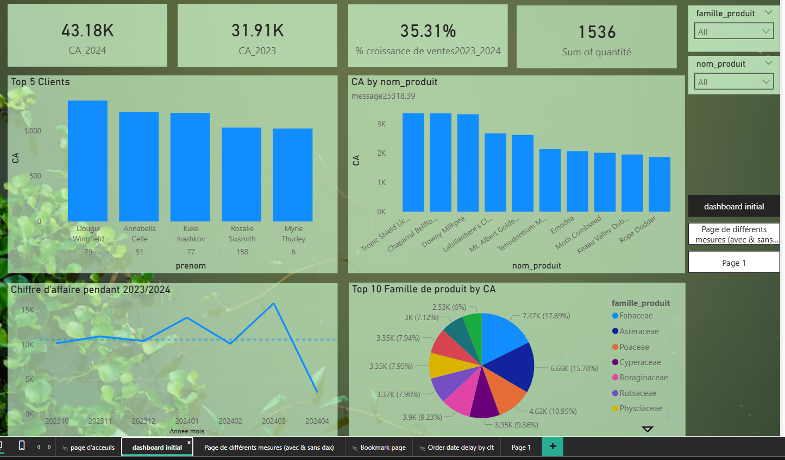

# Analyse des Ventes - Fleuriste Company

**Power BI** | **Tableau de bord interactif des ventes d'une entreprise de fleuristerie**

## 📋 Contexte

Ce projet consiste en l’analyse des performances commerciales d’une entreprise de fleuristerie sur la période 2023-2024.  
Le tableau de bord Power BI permet de suivre le chiffre d’affaires, la quantité vendue, la performance par client, par produit et par fournisseur de manière dynamique et interactive.

## 🎯 Objectifs du Dashboard

- Suivre l’évolution du Chiffre d’Affaires entre 2023 et 2024
- Identifier les clients, produits et fournisseurs les plus performants
- Analyser la répartition des ventes par famille de produits
- Observer les tendances mensuelles et détecter les pics d’activité
- Fournir une vue globale et détaillée pour faciliter la prise de décision

## 📊 KPI Principaux

- **CA 2024** : 43,18 K
- **CA 2023** : 31,91 K
- **Croissance des ventes 2023-2024** : **+35,31 %**
- **Quantité totale vendue** : 1 536 unités

## 🛠️ Sources de Données

Le rapport a été construit à partir d’un fichier Excel contenant **4 feuilles** :

- **ventes_2023-2024** : Transactions (date de commande, date de livraison, id_client, id_produit, quantité…)
- **produits** : Détails produits (nom_produit, famille_produit, couleur, prix_unitaire, id_fournisseur)
- **fournisseurs** : Liste des fournisseurs avec leur identifiant et nom
- **clients** : Informations clients (prénom, nom, pays, ville, code_pays)

## 📈 Modélisation des Données

- Modèle en **schéma en étoile** (Star Schema)
- Relations établies entre :
- Table des ventes ↔ Produits (via `id_produit`)
- Table des ventes ↔ Clients (via `id_client`)
- Produits ↔ Fournisseurs (via `id_fournisseur`)
- Création d’une table de dates pour l’analyse temporelle
- Mesures DAX créées pour calculer le CA, les croissances et les classements

## 📊 Visualisations Principales

### Page 1 – Vue Globale
- Cartes KPI (CA 2024, CA 2023, % croissance, Quantité totale)
- Top 5 Clients par Chiffre d’Affaires (histogramme)
- Top 10 Familles de produits par CA (graphique en secteur)
- Évolution mensuelle du Chiffre d’Affaires 2023-2024 (courbe)
- Top produits par CA (barres)

### Page 2 – Analyse Détaillée
- Tableau croisé par famille de produit avec CA 2023 / CA 2024 et % de croissance
- Répartition des clients par pays
- Performance par fournisseur (Top contributeurs)
- Évolution détaillée du CA par date
- Filtres interactifs par pays, famille de produit et nom de produit

Le rapport utilise des **signets** pour passer facilement d’une page à l’autre.

## 💡 Insights Clés

- Le chiffre d’affaires a connu une **croissance de 35,31 %** entre 2023 et 2024.
- Les familles de produits **Fabaceae**, **Asteraceae** et **Poaceae** représentent la plus grande part du CA.
- Une forte concentration des ventes sur un petit nombre de clients récurrents.
- Pic d’activité important observé au mois de mars 2024.
- Identification des fournisseurs les plus stratégiques (Toy Group, Abshire, Funk and Davis…).

---

**Auteur :** Hamza KHIAR  
**Date :** Avril 2026  
**Outil :** Power BI Desktop & Service  
**Portfolio Data Analyst**
